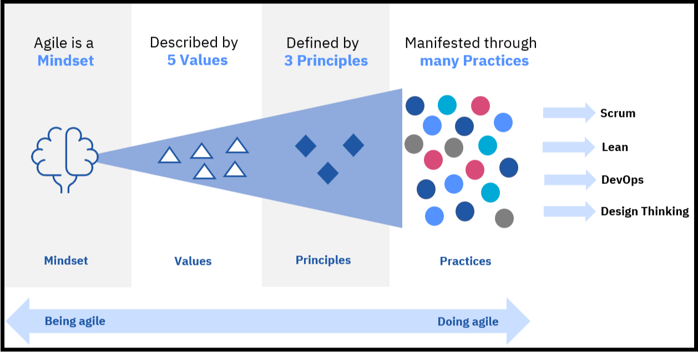
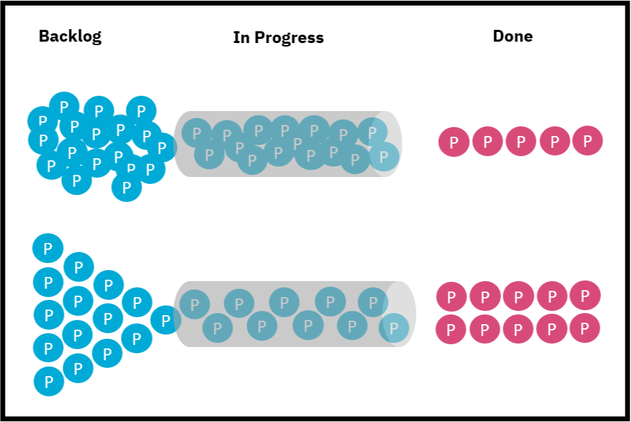

# agile

## What is agile?
Agile is a set of values, principles and practices that helps to change the culture and behaviors of the way we work. It’s a mindset and a cultural change.

Although agile methodologies started with software development, all types of teams, such as operational, marketing, human resources, recruitment, and others, can use its values, principles, and practices.

## IBM's agile values
IBM's agile values might differ somewhat from those you might find elsewhere. IBM has identified five agile values, which also reflect our company's values.

### Trust
Trust is the willingness to be vulnerable with others.

### Empathy
Empathy is the ability to understand another person's perspective or circumstance, whether you agree with this person or not.

### Respect
Respect is the way you treat people in different situations, whether you know them or not.

### Openness
Openness is the ability to be open-minded, willing to listen to other people's ideas, and being able to freely express yourself without fear or intimidation.

### Courage
Courage is the willingness to stand on your values and decide which of them you are willing to bend if the occasion warrants it.

## IBM's agile principles
What are the three principles that reflect the IBM company's values? Again, these principles might differ from those you might have read elsewhere. Learn more about them here!

1. Begin with clarity about the outcome, and let it guide every step along the way.
Knowing your goals will help keep your daily decisions on track. Deciding where you want to end up gives you clarity about what you need to do today.

2. Listen, iterate, learn, and course correct, rather than wait until perfection.
As you move toward your goals, new information might require you to re-examine them. Being agile means being flexible to make adjustments, to iterate and evolve. While it's important to have the outcome in mind, it's equally important to adapt quickly.

3. Build small teams with the right skills and encourage self-direction to unleash innovation.
Team members need to be empowered to make decisions. Leaders need to prioritize and provide clarity, and then stay out of the way.

## Agile practices to try!
What can you do to start working in agile ways? Here are a few practices you can try on your next project.

### Conduct daily stand-up meetings
Stand-up meetings are daily meetings (15 minutes or less) with your team. Team members should answer three questions:

1. What did I do yesterday?
2. What will I do today?
3. What could be blockers for me?

Stand-up meetings encourage team members to support one another to meet their goals. The intent is to enable transparency and foster communication and collaboration among teams. Blockers that are identified during the daily meeting need to be addressed in a timely manner. However, no problem solving occurs during the stand-up meetings.

### Slow down to do more
At IBM and other companies, people tend to try and cram as much as they can into the pipeline. People are generally not good multi-taskers. This is conveyed in the top half of the following graphic, showing the work-in-progress, or WIP, concept.

Working this way might not be efficient because we have a lot of work in progress rather than actually getting work completed. But if you slow down to focus on one thing and get it done without switching tasks, you can achieve more in a given period, as the lower section of the graphic shows.

### Have retrospectives
The end of an iteration (typically every two or three weeks) presents an opportunity for an agile team to reflect on its performance and look for ways to improve. This can be thought of as a "lessons learned" meeting. Rather than focus on what the team is building, the retrospective focuses on how the team is working. Schedule time (30 to 60 minutes) at the end of every iteration to conduct a retrospective discussion that focuses on three questions:

1. What worked well?
2. What did not work well?
3. What is puzzling us? How can we improve?

Pick one or two improvement opportunities identified during the meeting to focus on in the next iteration.

When you are learning and applying agile methodologies and practices, you might follow a certain approach. For example, when you first start to use agile practices, you might follow the instructions exactly. After you’ve done the practices a few times, you might want to experiment and find what works with your team. Once you learn what works for your team, you can share your techniques and ideas with other teams.

### Follow the rule
You get directions and follow the directions exactly. You don't play around.

### Break the rule
After you've practiced a few times, you might experiment and try different things.

### Be the rule
Once you master your experiments, you write your own directions or tell people about your own approach.

## Agile for leaders
Explore ways that leaders apply agile principles
The same agile principles that apply to teams also apply to leaders, but with a different focus.

### Focus on the outcome
Clarity of outcomeThis means focusing on the end state and working to achieve a shared understanding with everyone on the team of what the outcome should be. It also involves inspiring the team towards this outcome and helping the team to envision the outcome.

This principle demands setting clear goals, clarifying ambiguity, and could involve making some big decisions.

### Listen, iterate, learn, and course correct
Iteration over perfectionThis is all about doing the work iteratively but taking a few minutes to pause with the team to ask yourself that one critical question: How can I and we get better?

To leaders, this means to listen and seek feedback actively, acknowledge mistakes, focus on continuous improvement, and not demand perfection the first time.

### Create self-empowered, self-directing teams that innovate fantastically
Self-directed teamsSelf-directing teams means the leader empowers the team, steers and coaches, encourages innovative ideas, and holds the team accountable.

## What do you need to remember about this topic?
Being an agile leader is not an authoritative style where fear and command and control are in play. Instead, being an agile leader involves establishing a culture in which teams flourish and produce their best work.

Being an agile leader is about being a servant leader.

What’s a servant leader?
A servant leader:

1. Shifts from managing for results to designing environments that create results
2. Replaces self-interest with service to others
3. Influences rather than controls
4. Listens rather than gives orders
5. Focuses on long-term benefits rather than short-term benefits

